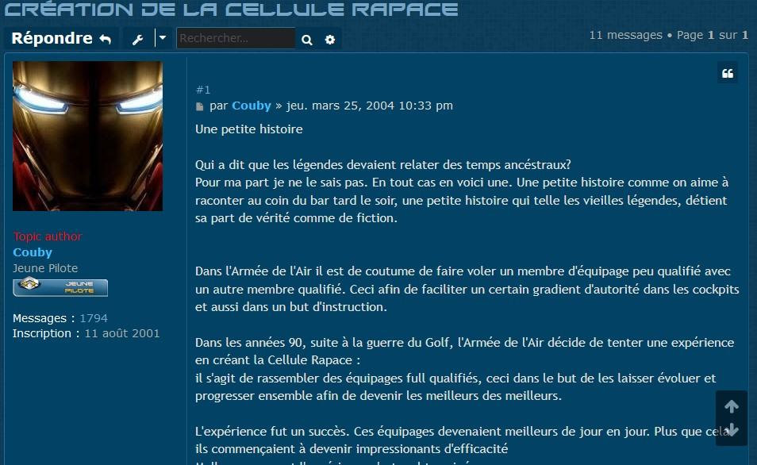
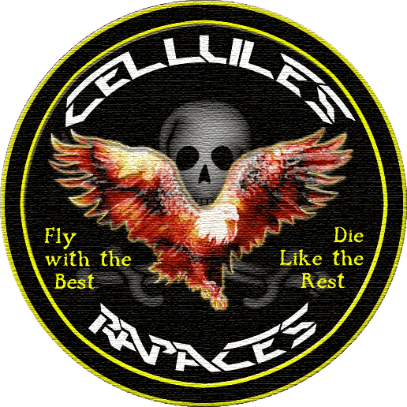

Une histoire racontée par **CoubyStark**, fondateur des Cellules Rapaces.

## Création

La création "officielle" de la toute première Cellule Rapace est annoncée par mes soins [sur le forum C6 le 25 mars 2004](http://www.checksix-forums.com/viewtopic.php?f=266&t=88843).

Elle regroupe les meilleurs pilotes virtuels francophones sur Falcon 4.0 de l'époque : Couby, Mav-jp, Abis, Bad Boy, Karandras, Jeffel, Markus, Shogun, Romain, Firefox13, RaiderOne et Spad.

Elle trouve ses origines dans l'organisation et le jeu de compétitions Arena [2vs2](http://www.checksix-forums.com/viewtopic.php?f=266&t=87201), [Arena TE](http://www.checksix-forums.com/viewtopic.php?f=266&t=88169).

Elle a connu ses premières heures de gloire dans la victoire au Low Land Tiger Meet 2004 🏆 .

Et ce n'était que le début d'une grande aventure 😊 .

## Histoire de patch

Le tout premier patch des Cellules Rapaces a été réalisé par Karandras en suivant mes indications.

Le brief était :
- un fond avec une tête de mort, pour l'esprit pirate 🏴‍☠️
- un beau Rapace flamboyant
- une calligraphie moderne avec des lignes agressives
- et la devise Fly with the best - Die like the rest

C'est après notre participation et victoire au Low Land Tiger Meet 2004 que nous avons ajouté un contour tigré, afin de marquer désormais notre appartenance à la communauté Tiger.
RRROOOOAAAARRRR 🐯

## More to come

Je reviendrai étoffer ce salon d'archéologie numérique 🔍 à l'occasion, en relatant les grands moments comme les moments difficiles jusqu'à cette nouvelle étape de *Refondation*.
