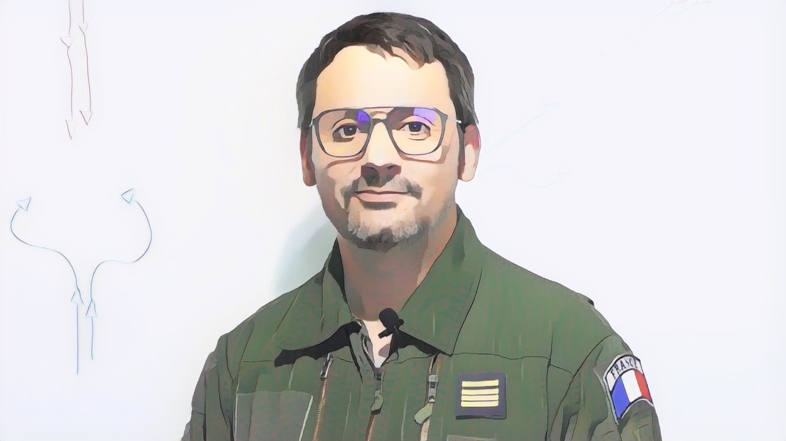
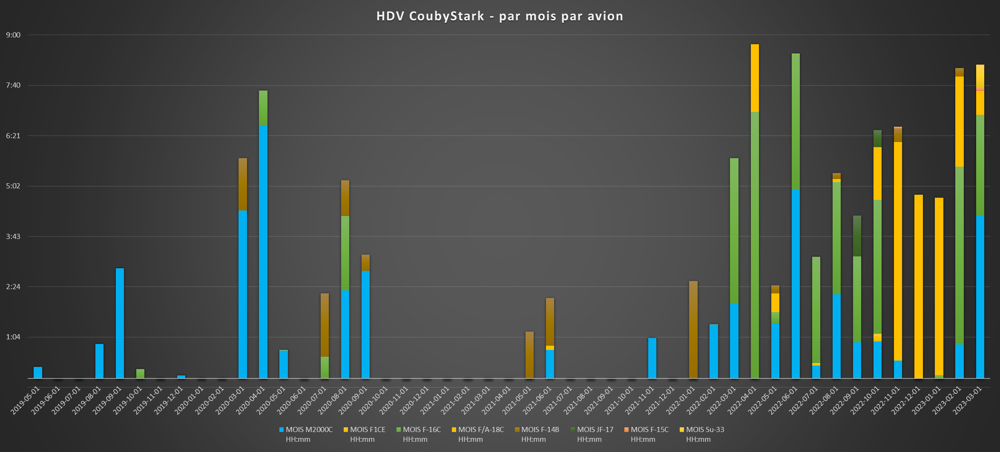
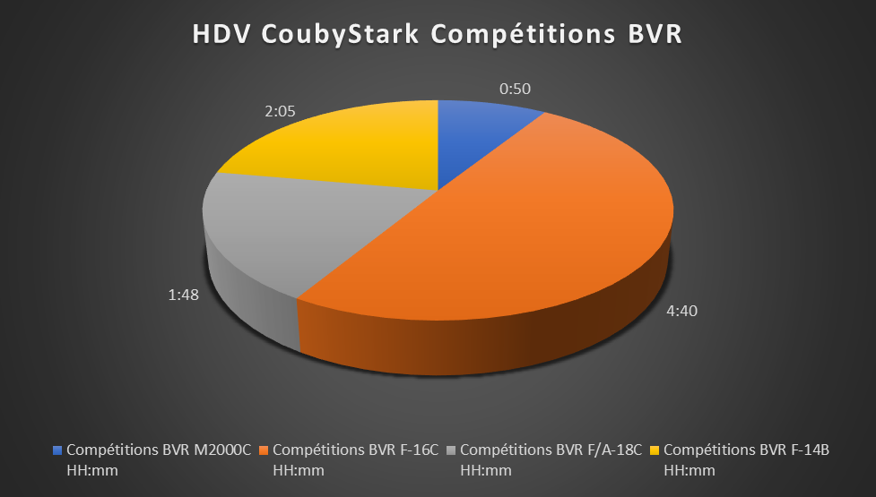
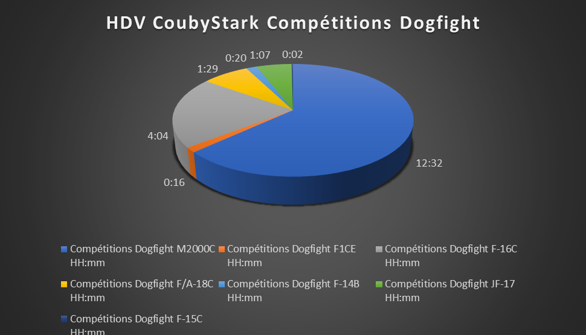
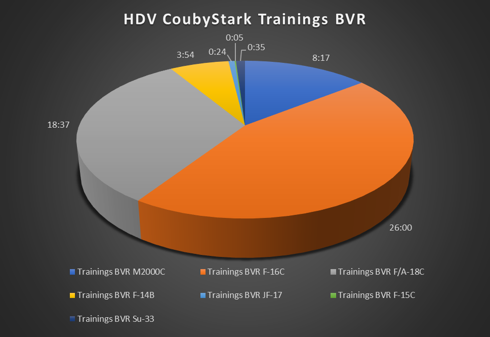

- Nom / Callsign : Frédéric / CoubyStark
- Age : 46 ans
- Région : Mont-de-Marsan
- Profession : Pilote et ingénieur
- Expérience Pilote IRL : ~3000 heures de vol

## Expérience sur DCS
J'ai commencé à pratiquer DCS en 2019, avec rapidement l'objectif de revenir à la compétition.

En 2021 je refonde les Cellules Rapaces avec l'objectif de reconstruire une équipe dédiée à l'approche eSport de la simulation de vol militaire.

J'aime beaucoup la variété offerte par DCS au niveau des modules qu'il est possible d'utiliser. J'apprécie de voler sur les machines modernes et puissantes. J'aime aussi relever des défis en utilisant des avions limités au niveau de leurs capacités, et tester des tactiques exploitant tous les aspects que permet la simulation (carburant, timing, couvertures radars, dimensions du théâtre d'opérations, spécificités armements...). J'affectionne plus particulièrement le combat aérien BVR.

Il m'arrive de jouer GCI.

## Historique en compétition
- Tournois dogfights caritatifs *Fight For Honor* (2019, 2020) et *Merge For The Cure* (2020)
- Tournois dogfights BFR (2020 à 2023)
- ELO Dogfight depuis 2022
- Tournoi BVR BFR (2022, 2023)
- Winter On Fire 2023,
- SATAL 2023,
- GamePlan.

## Matériel de gaming
- Thrustmaster HOTAS Warthog
- Manches TM F-16 et F-18
- Thrustmaster TQS
- Casque VR HP Reverb G2

## Statistiques de vol au 01/01/2023

