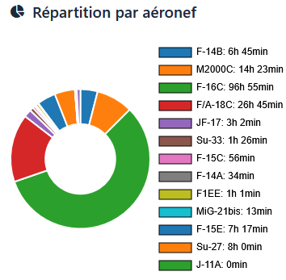

- Nom / Callsign : Frédéric / CoubyStark
- Age : 48 ans
- Région : Mont-de-Marsan
- Profession : Pilote et ingénieur
- Expérience Pilote IRL : ~3000 heures de vol

## Expérience sur DCS
Après près de vingt ans passés sur Falcon 4, je me mets à pratiquer sérieusement DCS en 2019, avec dès le départ l’envie de renouer avec la compétition.

En 2021, je relance les Cellules Rapaces avec l’ambition de bâtir une équipe tournée vers l’approche eSport en simulation de vol militaire.

Ce qui me passionne dans DCS, c’est la richesse des modules disponibles et la variété des expériences : piloter des machines modernes et puissantes, relever des défis avec des avions aux capacités limitées, ou encore imaginer des tactiques exploitant toutes les dimensions offertes par la simulation — carburant, timing, couvertures radar, caractéristiques du théâtre d’opérations, spécificités des armements...

Ma préférence va toutefois au combat aérien BVR, autant pour la finesse stratégique que parce qu’avec l’âge, la pratique intensive du dogfight me donne vite un torticolis 😅.

Il m'arrive de jouer GCI.

## Historique de participation aux compétitions DCS
- Tournois dogfights caritatifs *Fight For Honor* (2019, 2020) et *Merge For The Cure* (2020)
- Courses Tanker Party 2020 - 2021
- Tournois dogfights BFR (2020 à 2023)
- ELO Dogfight 2022 - 2023
- Tournoi BVR BFR (2022, 2023)
- Winter On Fire 2023 et Winter On Fire II 2024
- SATAL 2023
- Canyon Run Dagger One 2023 - 2025
- GamePlan 2024
- Tournoi DCS Competitive 2v2 2024
- Tournoi Phobetor F18 1v1 2024
- Tournoi ACWS 1v1 2025
- Tournoi BVR Cold War Manchots 2025
- Tournoi ACWS 4v4 2025 (en cours)

## Compétitions organisés par mes soins
- Courses Tanker Party 2020 - 2021
- ELO Dogfight 2022 - 2023
- Canyon Run Dagger One 2023 - 2025
- En cours de lancement, Ladders Combats Aériens Rapaces

## Matériel de gaming
- Thrustmaster base AVA
- Manches TM F-16 et F-18
- Thrustmaster Throttle Warthog
- Casque VR HP Reverb G2

## Statistiques de vol DCS au 31/08/2025
⏱️ Heures de vol : 169h21

🛫 Nombre de vols : 1362

