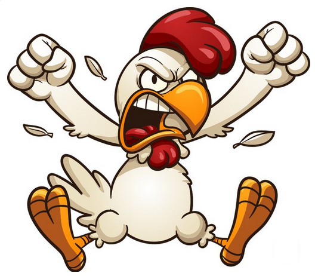

- Nom / Callsign : - / Galinette
- Age : - ans
- Région : Nantes
- Profession : Développeur CGI (imagerie numérique)
- Expérience Pilote IRL : - heures de vol

## Expérience sur DCS
Galinette est actif sur Digital Combat Simulator depuis 2020 environ. Il a plongé dans la simulation avec passion, attiré notamment par les avions de chasse modernes et leurs radars sophistiqués. Très vite, le Mirage 2000C – l’emblématique chasseur français – est devenu son appareil de prédilection, au point qu’il en connaît chaque système sur le bout des doigts. Ce pilote virtuel affiche un style de jeu porté sur le réalisme technique : il adore exploiter à fond les capteurs et suivre les procédures opérationnelles réelles. En combat BVR (au-delà de la portée visuelle), sa maîtrise des radars lui donne souvent un coup d’avance pour détecter l’ennemi avant même d’être repéré. Mais il ne rechigne pas non plus à engager le dogfight rapproché quand il pilote son Mirage – même sans FBW, il sait le pousser dans ses retranchements de G-limit! Son approche est méthodique et tactique, privilégiant la connaissance approfondie de son appareil pour en tirer le meilleur parti dans chaque situation.

Ses modules favoris reflètent clairement ses centres d’intérêt pour l’avionique avancée. Le Mirage 2000C reste son grand amour (comment pourrait-il en être autrement ?), et il a aussi énormément volé sur le F-15E Strike Eagle, un bimoteur qu’il affectionne pour son radar APG-70 ultra-puissant. La communauté DCS reconnaît d’ailleurs que Galinette a repoussé les limites du possible sur ces deux machines, tant il en maîtrise les rouages internes. Il n’est pas rare de le voir partager des comparaisons entre systèmes d’armes, discuter des différences entre générations d’appareils, ou tester minutieusement chaque fonctionnalité nouvellement implémentée en jeu. En résumé, Galinette est le genre de sim-pilote pour qui comprendre le « pourquoi du comment » d’un radar ou d’un FBW est aussi important que de remporter la victoire virtuelle.

## Contributions à la communauté
*Un Mirage 2000C paré de la livrée spéciale “Radar Chicken God”, créée en 2024 par la communauté DCS en hommage à Galinette.*
[digitalcombatsimulator.com](https://www.digitalcombatsimulator.com/fr/files/3338363/#:~:text=To%20honour%20RCG%2C%20who%20departed,2000%20Version)

Galinette s’est imposé comme un membre éminent et apprécié de la communauté DCS, non seulement par son niveau en vol mais surtout par sa générosité technique. Sur les forums officiels d’ED, il n’hésite pas à répondre aux questions pointues des autres pilotes virtuels, partageant son savoir avec pédagogie. Par exemple, c’est lui qui a livré une explication détaillée du fonctionnement du collimateur de tir du Mirage 2000C (la fameuse “snake” ou “spaghetti” en mode canon) pour aider un joueur à mieux l’utiliser. Ce genre de tutoriel improvisé et ultra-technique est devenu sa marque de fabrique : Galinette adore démystifier les systèmes d’armes et expliquer le pourquoi du comment aux curieux. Il traîne souvent sur les sections support ou bug report du forum, où il analyse des trames de vol, identifie l’origine d’un problème (parfois c’est juste un axe mal calibré ou un effet transsonique mal compris) et oriente les joueurs vers des solutions. On peut dire qu’il fait presque office de service après-vente communautaire pour certains modules, en particulier le Mirage 2000C qu’il chérit tant.

En plus de son activité sur les forums, Galinette est présent sur les Discords francophones de DCS, où son pseudo ne passe pas inaperçu. Son expertise des radars et capteurs lui a même valu un surnom affectueux : “RCG” pour Radar Chicken God. Ce clin d’œil humoristique combine le côté gourou du radar et une référence à son callsign (la galinette étant une petite poule 😉). Lorsque Galinette a pris du recul en 2024, la communauté française lui a rendu un vibrant hommage en publiant une livrée personnalisée “Radar Chicken God” pour le Mirage 2000C. Ce skin arbore fièrement un poulet couronné sur le fuselage – difficile de faire plus iconique ! Ce genre d’initiatives montre l’impact qu’a Galinette sur la communauté DCS : ses contributions ne passent pas inaperçues, et beaucoup de pilotes virtuels saluent son dévouement à améliorer l’expérience de tous. Que ce soit par des missions test qu’il organise en petit comité, des conseils qu’il dispense ou même quelques lignes de code glissées en bonus pour régler un dysfonctionnement, Galinette incarne l’esprit d’entraide et de passion qui anime la communauté DCS.

## Historique de participation aux compétitions DCS
- Tournoi BVR BFR (2022, 2023)
- Canyon Run Dagger One 2025 / Vainqueur du tournoi duel #3

## Matériel de gaming
- HOTAS Virpil
- Casque VR HP Reverb G2

